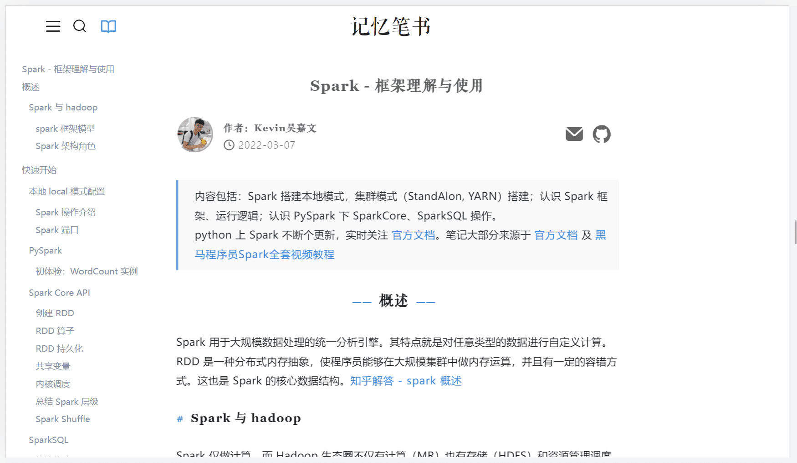
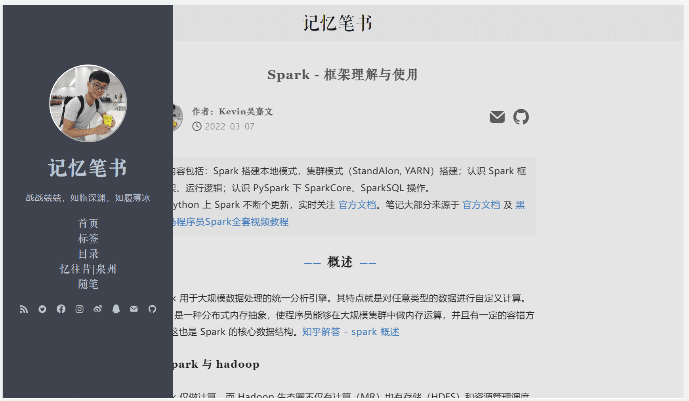

# halo-them-knarc

## 说明


本主题 v1.0 版本基于 [halo-theme-anatole](https://github.com/halo-dev/halo-theme-anatole) 进行了修改，其主题的原作者为 [Caicai](https://www.caicai.me)。**个人非常喜欢 Anatole 的简约风格，非常感谢主题的原作者！！** 

v2.0 版本基于 v1.0 版本做了很大的改动，**你可能感觉基本上看不到 Anatole 的影子了**，请谨慎更新！！！

**暂停更新：** 目前该主题停留在 halo 1.5.x 版本，对 halo 高版本可能存在适配问题，更新时间待定，笔者要继续加班打工了😇。

## 预览截图

**【首页预览】**


**【文章页面预览】**

**【侧边栏预览】**

有过用 Linux-arc 主题的朋友应该很熟悉上面这种配色，是的该主题参考了 arc 的配色方案（kevin + anatole + arc = knarc [滑稽狗头.jpg]）。当然该主题也保留了Anatole 原始的白色简洁风格，另外文章归档页面做了小小的修改：



## 安装与使用

【本地安装】点击 `code` 下载代码为 `.zip` 格式，进入后台 -> 外观 -> 主题 -> 安装 -> 本地安装，上传该 `.zip` 代码即可。

 【远程安装】进入后台 -> 外观 -> 主题 -> 安装 -> 远程下载，输入 https://github.com/kevinng77/halo-theme-knarc.git ，点击下载。若觉得 github 下载速度慢，可以尝试使用 gitee 源 https://gitee.com/kevinng77/halo_theme_knarc.git。

## 修改历史

### Knarc - v2.0

该版本主题较为简介，其观赏性很大程度上依赖文章图片。

> 【重要】该版本改动较大，更新请慎重！！！

> 【重要】主题设计中使用了方正清刻本悦宋字体，由于字体较大，因此仓库中仅仅抽取了该字体的子集进行加载。使用者可以在网上下载 TTF 文件后自行抽取子集，并替换 `source/fonts` 下的 `**_subset.ttf` 文件即可。

修改了博客整体布局，包括：

+ 首页设计将备案/版权等信息统一移动到了页面最下方，保留 Anatole 原作者信息。
+ 首页添加了分类幻灯片导航窗口。**<u>只有添加了封面图的类别才会显示在导航栏中！！你可以在halo后台的 文章》分类目录》封面图 进行设计。</u>**
+ 修改了文章内容样式，包括文章标题字体、文章引言、文章字体大小、代码高亮字体、文章整体布局、文章目录显示方式等。
+ 修改了目录风格，**移动端下暂时不支持目录**。
+ 修改顶栏，包括搜索页面、logo等；
+ 修改了搜索页面，点击搜索按钮后将弹出搜索页面而非拓展搜索栏。
+ 开关式左边栏，手机端与网页端下在任意页面点击 “三” 按钮实现开关侧边栏。
+ 修改了标签显示风格。
+ 取消了部分主题风格配置选项，如侧边栏阴影等。
+ 简化了归档栏的显示。

#### TODO:

- [ ] 【重要】首页文章设置为卡片
- [ ] 归档页面重新设计
- [ ] 手机端目录

### Knarc - v1.0

> 相对于  [halo-theme-anatole](https://github.com/halo-dev/halo-theme-anatole)，本主题主要做了以下修改：

修改了博客整体布局和风格添加了 Arc 配色方案。包括：

+ 左边栏头像锁定为圆形，缩小左边栏比例；
+ 修改归档页面、首页中的文章块风格；
+ 博客页面风格修改，如行间距、引言风格、评论区等；
+ 搜索栏改为点击触发。
+ 左边栏可配置背景图案
+ 修改了index（首页）的文章展示布局

修改代码高亮方案。包括：

+ 修改行内代码高亮格式，从红色高亮改为了 `灰色背景代码块`。
+ 修正了代码块高亮BUG，代码高亮方案改用 highlightjs，支持更多代码高亮风格。

添加文章目录按钮（基于 [Moon-Menu](https://github.com/jiangtj-lab/hexo-cake-moon-menu) 设计），支持文章 `h1,h2,h3` 标题链接跳转。

优化了手机/平板模式下的显示，小屏幕下仅显示首页会显示左边栏信息。

### TODO

- [ ] 【重要】添加多 Tag 标签功能，优化 Tag 标签风格。
- [ ] 支持通过后台调整目录显示内容： `h1,h2,h3`...
- [ ] 图片与下面图描述居中(对需要居中的行添加特定的居中符号)
- [ ] 标签显示的方案
- [x] 备案信息位置
- [x] menu目录样式更改，添加点击效果
- [x] 目录展开时候特效调整，收缩时候特效调整
- [ ] index页面支持<--more--> 截取摘要片段

## 其他

#### **数学公式：**

markdown中添加

```html
<link rel="stylesheet" href="https://unpkg.com/katex@0.12.0/dist/katex.min.css" />
```

即可，小工具导入的文章需要手动通过后台发一次才能生效（不知道是不是halo系统原有的bug）

#### **评论头像**

修改 `系统>博客设置>评论设置>Gravatar 镜像源`，换为国内源如 https://sdn.geekzu.org/avatar/

#### **额外代码块风格**

笔者挑选了部分推荐的代码主题，可在后台配置。更多主题和语言可在 [highlightjs 官网](https://highlightjs.org/download/)  下载安装。使用其他代码块风格指南：

1. 该项目使用的是 highlight 的代码高亮插件，首先登录 [highlightjs 官网](https://highlightjs.org/download/)  ，选择代码语言，而后下载 `highlightjs.zip`。
2. 将下载好的文件解压放在 `source/plugins/highlightjs` 下，从 `source/plugins/highlightjs/styles` 文件夹中挑选喜欢的代码皮肤。
3. 在 `settings.yaml` 中的 `code_pretty` 添加 风格名称的选项，如选中 `styles/default.min.css`，则在 `option` 下添加对应的 `value: 'default'`, `label: 'default'` ：

```yaml
    code_pretty:
      name: code_pretty
      label: 文章代码高亮主题
      type: select
      default: 'default'
      options:
        - value: 'default'
          label: 'default'
        - value: '风格名称'
          label：'后台显示的风格名称'
```

4. 在后台选择新代码风格。

#### 添加备案信息：

在 halo 后台点击 设置 -> 博客设置。在 常规设置 -> 页脚信息中添加备案信息，如：

```html
<a href="https://beian.miit.gov.cn/" target="_blank">备案号</a>
 
<a href="http://www.beian.gov.cn/portal/registerSystemInfo?recordcode=" target="_blank">
闽公网安备 备案号 
</a>
```
